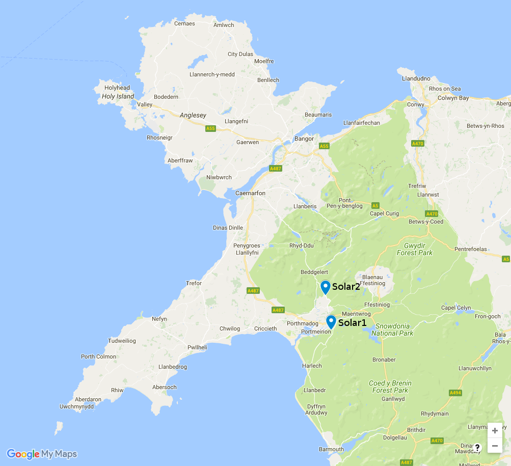
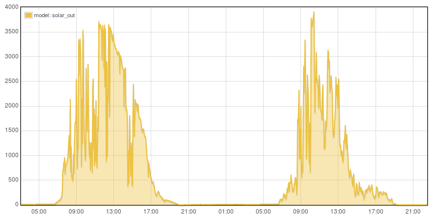
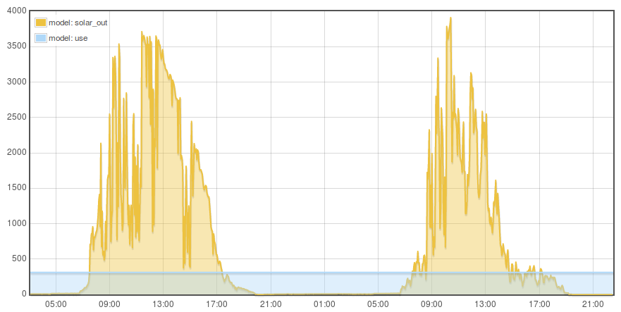
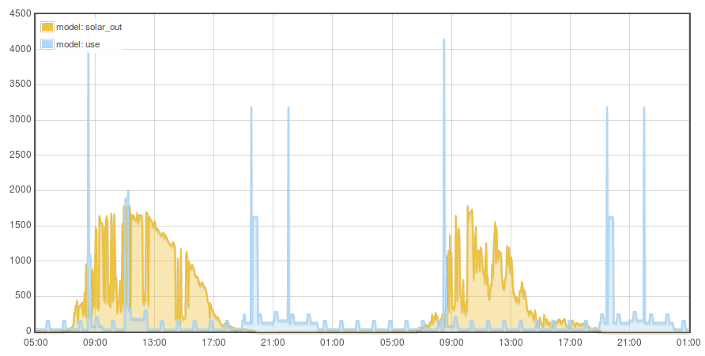
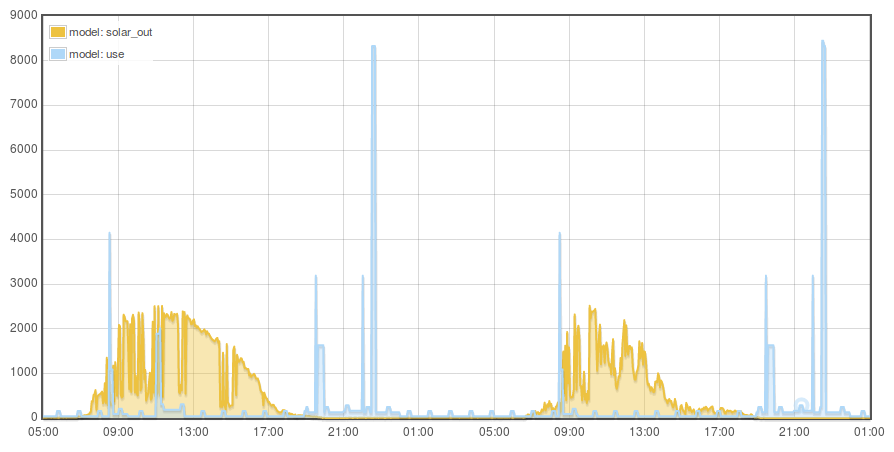
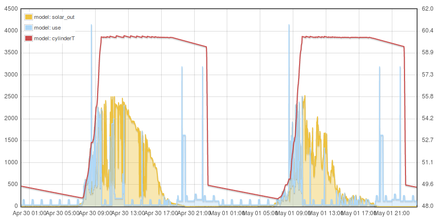
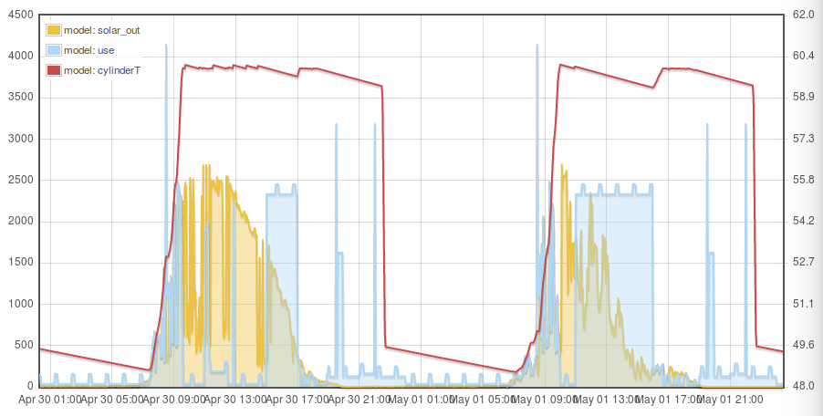
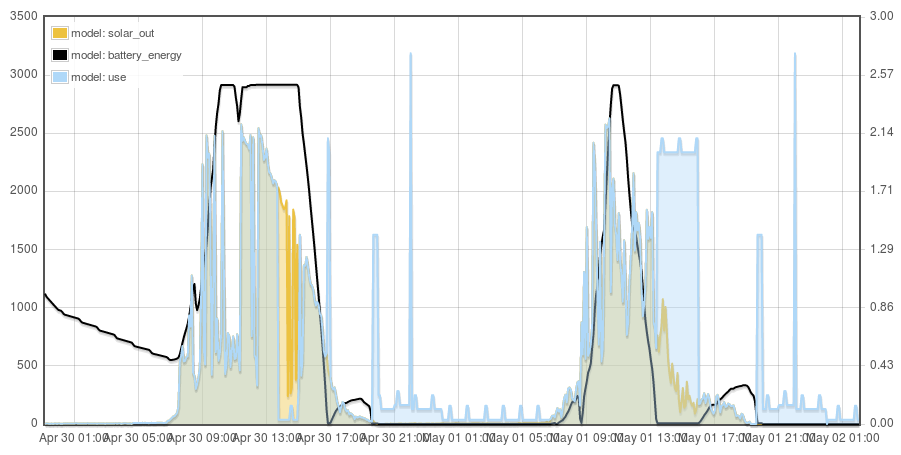

##  Solar self-consumption model

The degree of self consumption makes all the difference to the economics of domestic solar PV. Especially with recent reductions in feed in tariff rates in the UK and a view looking forward to unsubsidised solar.

Traditional household demand peaks in the morning and evenings on weekdays with a slightly more even profile on weekends. Solar generates most in the middle of the day resulting in a mismatch between supply and demand. Traditional demand without using excess solar for hot water, smart charging of EV’s or battery stores results in a self consumption of around 22%. Adding in these flexible sources of demand can increase the degree of self-consumption all the way up to 70-98%.

In order to get an idea for the potential levels of self consumption that could be reached with different demand patterns, PV Diversion, EV charging and battery storage without carrying out lengthy empirical trials we can build a household electricity model that can later be verified with real world trials. The following gives an example of building such a model, using high resolution 10s solar pv data collected by monitoring combined with a detailed model of household demand, it calculates the degree of self consumption that would result from different household demand profiles.

The household model covers the traditional demands such as: lighting, laptops, internet router, central heating standby, kettle, electric shower, electric cooking, fridge/freezer, washing machine. Each with start and end times, power levels and in the case of fridge/freezer cycle repeat times. Weekday and weekend schedules are also taken into account.

PV Diversion, smart EV charging and battery storage are then added to explore how self consumption increases.

### 1. Model Basics: Reading in solar PV data

<table class="table">
<tr>
<td style="width:50%">

The following examples use solar PV datasets from two installations in Snowdonia, North Wales collected over the last couple of years using OpenEnergyMonitor equipment.

<b>Solar1:</b> is a south facing 3.8 kW ground mounted system, normalised to 4.0 kW capacity.

<b>Solar2:</b> is a south facing 3.0 kW roof mounted system, again normalised to 4.0 kW capacity. This system has slightly more overshading than system 1.

</td>
<td></td>
</tr>

<tr>
<td style="width:50%">

This first example loads a solar PV feed from emoncms from our Solar1 dataset. The system achieves an output of 797 kWh/kWp.

Solar2 has an output of 741 kWh/kWp for the same period.

View source code: 1.php

</td>
<td></td>
</tr>
</table>

### 2. Flat demand

<table class="table">
<tr>
<td style="width:50%">

This second example introduces a basic flat demand profile and calculates the degree of solar self consumption as well as excess solar generation and amount of unmet demand.

If we set the flat demand profile to match the annual output of the 4kW solar PV system, the degree of solar self consumption is 35% and the proportion of demand supplied by the solar is also 35%.

Setting the solar PV capacity to 2.0 kW, halving the solar generation relative to demand results in a solar self consumption of 54% and reduction in demand supplied by solar to 27%.

If the peak output of the solar PV system matched the flat demand level self consumption would be 100% but the amount of demand supplied by the solar would be relatively small (9%).

View source code: 2.php

</td>
<td></td>
</tr>
</table>

### 3. Traditional domestic electricity demand

<table class="table">
<tr>
<td style="width:50%">

This example replaces the flat demand profile with a detailed model of traditional household electricity demand and again calculates the degree of solar self consumption as well as excess solar generation and amount of unmet demand.

The traditional demand model covers: lighting, laptops, internet router, central heating standby, kettle, electric shower, electric cooking, fridge/freezer, washing machine. Each with start and end times, power levels and in the case of fridge/freezer cycle repeat times. Weekday and weekend schedules are also taken into account. The modelled demand totals 1219 kWh/year or 3.3 kWh/d.

If we set the solar PV system size to match the annual electricity demand (~1.6kW), the degree of solar self consumption is 24% and the proportion of demand supplied by the solar is also 24%.

Halving the solar generation relative to demand results in a solar self consumption of 38% and reduction in demand supplied by solar to 19%.

View source code: 3a.php

If we add an electric shower to the demand model, ran daily at 9:30pm for 10mins (enough for 2x short showers) it raises the consumption from 1219 kWh to 1718 kWh, 1.37 kWh/shower. If we keep the solar capacity the same as the example above, the self consumption stays the same at 24% while the demand supplied from solar falls to 17%, which makes sense as we are not adding any day time demand that the solar can supply. If we increase the solar capacity so that generation matched demand on an annual basis (2.2kW) the solar self consumption falls to 19%, while the demand supplied by solar raises to 19%.

View source code: 3b.php

</td>
<td>

Lighting, Appliances and Cooking: 
  

Demand including electric shower: 
</td>
</tr>
</table>

### 4. Solar diversion to hot water

<table class="table">
<tr>
<td style="width:50%">

While instantaneous electric showers result in minimal energy loss compared to hot water cylinder systems, the demand is much more likely to happen at peak times where the grid is under most strain and peaker plants are most active. In a zero carbon energy system where peak demand exceeds wind and solar supply this unmet demand will likely be supplied by less efficient backup renewable gas systems. The ability to use storage such as heating up hot water cylinders can provide a good way of shifting demand.

The simplest way of heating hot water with solar PV is with a PV Diverter – a box of power electronics that measures the amount of excess solar available and ‘diverts’ this excess electricity to an immersion heater. A more efficient but more complex way of doing this and more limited in terms of responsiveness would be to heat hot water via a heat pump.

This example adds a hot water cylinder and PV diverter to the previous example. So that we can use the excess solar to heat up the hot water cylinder in order to avoid the need to import power from the grid later.

Keeping the solar PV system size as above (2.2kW) and adding a 120L hot water cylinder with a PV diverter increases the solar self consumption from 19% to 52% and the demand supplied from solar from 19% to 49%.

The hot water cylinder adds to the system losses and so pushes up overall demand by 7.3%. Increasing the solar PV system size to match annual demand (2.4kW), results in a solar self consumption and demand supplied from solar of 49%.

Doubling the hot water cylinder size to 240L and adjusting the solar PV system size again (2.6kW) results in a solar self consumption of 54%.

Halving the solar PV system size (1.2 kW) to produce half of the demand over a year, while keeping the hot water cylinder size at 120L results in a solar self consumption of 80% and a demand supplied from solar of 41%.

View source code: 4.php

</td>
<td></td>
</tr>
</table>

### 5. Day time and smart charging of an electric vehicle

<table class="table">
<tr>
<td style="width:50%">

Smart charging an EV when the sun is shining could also increase self consumption, particularly useful to anyone that works partly from home, or where the car is left at home perhaps on sunny days and its possible to cycle to work? Alternatively smart charging of EV’s at work would also make a lot of sense.

This example add's just over 2000 kWh of EV charging, enough to drive ~8000 miles. The following charging times assume quite a bit of home charging.

Monday: 9am - 11am @ 2.3 kW Tuesday: 2pm - 4pm @ 2.3kW Wednesday: 10am - 3pm @ 2.3kW Saturday: 9am - 11am @ 2.3kW Sunday: 9am - 3pm @ 2.3kW

Adding this demand to the previous example with PV diversion where solar self consumption was 48%, increases the solar self consumption to 71% (if we keep the solar capacity the same at 2.4kWp) while the proportion of demand supplied by the solar falls to 34%.

Matching annual solar output with demand results in a solar self consumption and demand supplied from solar of 48% with a 5.1kW system.

Given that most domestic solar systems are at most 4.0 kW, limiting to this would result in a self consumption of 55% and demand supplied by solar of 43%.

View source code: 5.php

</td>
<td></td>
</tr>
</table>

### 6. Battery Storage

<table class="table">
<tr>
<td style="width:50%">

Another option much talked about at the moment due to the dropping price, a battery store can soak up solar during the day and make it available later in the evening when demand is usually highest.

Adding a 2.5 kWh battery to the previous example (4.0kW PV) raises solar self consumption from 55% to 77% and the demand supplied by solar from 43% to 60%.

Adding a 5.0 kWh battery raises solar self consumption to 82% and the demand supplied by solar to 64%.

Adding a 10.0 kWh battery raises solar self consumption to 86% and the demand supplied by solar to 68%.

We can see that most of the benefit is to be had with the first kWh's of storage, adding more storage has reducing gains.

Increasing the solar PV system size to match demand on an annual basis (5.1kWp) results in a solar self consumption and demand supplied from solar of 75%. A system size designed to generate half the annual demand (2.5kWp) results in a self consumption of 99%.

The black line in the screenshot on the right shows the battery SOC. The EV charge later in the day is drawing from the battery as well as solar, leaving no capacity for the later evening peak, perhaps the control algorithm could be improved? (if removing the evening peak was of higher importance).

View source code: 6.php

</td>
<td></td>
</tr>
</table>

These examples show the potential of PV diversion, smart EV charging, battery storage and optimising the solar PV system size on solar self consumption, with the potential to increase self consumption from ~24% all the way up to 80-99% and the potential to increase the percentage of demand supplied by solar to 50-75%.

### Looking at costs

For most applications we will likely want to factor in cost as part of working out the optimum solar and battery installation size. We usually want to compare the energy cost that results from a given system with typical energy costs that we are used to. Given that solar and associated kit are often large capital investments we want to know the payback time, how long does it take for our system to break even with what the cost of power would have been had we imported from our electricity supplier.

It's perhaps worth reflecting that the energy cost that we are used to is in many ways arbitrary, there is no law of nature that says domestic electricity should cost 15.2 p/kWh. It could cost twice this or half this amount. 

**Cost of Carbon** 
The cost of fossil fuel energy does not usually reflect the cost of its externalities either, the cost of damages caused by climate change, adapatation measures etc, health impacts, these costs are passed on to us in other ways.

- [Twitter thread on direct air capture carbon sequestration costs by Glen Peters](https://twitter.com/Peters_Glen/status/1004996406342537216)
- [Carbon Breif: Q&A Social Cost of Carbon](https://www.carbonbrief.org/qa-social-cost-carbon)
- [Carbon Capture Is Expensive Because Physics](https://cleantechnica.com/2016/01/19/carbon-capture-expensive-physics/)

Natural gas, the cleanest form of fossil fuel electricity generation, has a carbon intensity of ~360gCO2/kWh. If the cost of removing carbon is on the lower end: $100/tCO2 (£75/tCO2), removing this CO2 could add 2.7 p/kWh to our electricity price, alternatively if the cost of removing carbon is $300/tCO2, we would need to add 8.1 p/kWh to the electricity price.

**Carbon reduction effectiveness** 
Another way to look at cost is to compare the cost effectiveness of different measures at reducing carbon emissions. Given a limited budget, we might ask: is it better to spend £5000 on solar or on house insulation? We might prioritise the measures that provide the largest carbon reduction per pound spent first.

**Solar PV costs** 

A following reflects typical domestic solar PV installed costs in 2018. From two recent quotes that I have seen £6000 for a roof mounted 4kW system without solar edge inverters seems to have held steady for the last couple of years - although a price reduction over time is of course expected. (Prices include VAT)

| Capacity | Estimated Cost (£) | Cost £/kW |
|----------|--------------------|-----------|
| 1kW      | 2500-3000          | £2,750.00 |
| 2kW      | 4000-5000          | £2,000.00 |
| 3kW      | 5000-6000          | £1,833.00 |
| 4kW      | 6000-7000          | £1,625.00 |

Solar PV lifetimes are expected in 35 year+ and inverter lifetimes are now suggested to be up to 20-25 years.

The following equation fits the lower bound on solar costs quoted above:

    system_cost = 2500 x solar_kw^-0.368 x solar_kw

While solar PV modules themselves are likely to last 35+ years if we want to extend our cost calculation beyond the 20-25 year point we also need to include replacement inverter costs. Its possible to buy a 4kW replacement inverter today for £850 to £1200. If we assume a 60% reduction by the year 2038 reflecting a typical solar PV system component learning rate, then an additional £340 to £480 might need to be spent at year 20 + installation ~£120?.

**DIY Solar**

One option to reduce solar costs could be to take the DIY approach, Bimblesolar are one company who supply solar components for DIY applications from homes to vans and boats: [https://www.bimblesolar.com](https://www.bimblesolar.com). There would likely be an additional cost required here to have an electrician complete the connection.

| Capacity | Estimated Cost (£) | Cost £/kW |
|----------|--------------------|-----------|
| 1kW      | £983          | £983 |
| 2kW      | £1587         | £794 |
| 3kW      | £2690         | £897 |
| 4kW      | £3447         | £673 |

The following equation gives a reasonable fit:

    system_cost = 983 x solar_kw^-0.095 x solar_kw

**PV Diverter costs** 

A myenergi solar PV diverter costs £365.

**Battery costs**

Current solar battery costs appear to be in the region of:

| Capacity | Estimated Cost (£) | Cost £/kW |
|----------|--------------------|-----------|
| 2kWh (powervault) | 2500          | £1250 |
| 3.3kWh (solax)    | 1750          | £530 |
| 4.8kWh ([solax](https://www.bimblesolar.com/batteries/lithium-batteries/solax-battery-48))    | 2500          | £520 |
| 4kWh (powervault) | 3500          | £875 |
| 6kWh (powervault) | 4500          | £750 |
| 14kWh (tesla)     | 6000          | £430 |
| 2.4kWh ([pylon](https://www.bimblesolar.com/batteries/lithium-batteries/pylon-li-ion-2.4kw)) | 850 | £354 |

- [Solar Battery cost examples](https://www.which.co.uk/reviews/solar-panels/article/solar-panels/solar-panels-and-energy-storage)

These costs are for the battery units only, without installation.

Battery costs have seen a 14% year on year reduction in cost between 2007 and 2014, reaching ~£500/kWh today. A 10% year on year reduction for the next 15 years would result in a battery cost of £114/kWh. A further 5% reduction in cost from year 15 to 30 would result in battery costs of £56/kWh. [source?]

**Feed in Tariff's 2018**

- Generation tariff: 4.11 p/kWh.
- Export tariff 4.9 p/kWh (deemed 50%)
- Standard tariff 15.2 p/kWh

### Example results with costs

The following example results are costed versions of the model runs above. Calculation assumes no energy cost inflation above retail-price-index to keep things simple.

| MCS Installed cost & Subsidy | Use kWh/d | Solar kWh/d | Self-use % | System cost 20y | System cost 35y | Payback inc subsidy | Payback w/o subsidy | 20y unit cost inc subsidy | 35y unit cost inc subsidy | 35y unit cost w/o subsidy |
|----------------------------------------------------|-----------|-------------|------------|-----------------|-----------------|---------------------|---------------------|---------------------------|---------------------------|---------------------------|
| 1.5kWp of solar + trad household demand | 3.3 | 3.3 | 24% | £3,268 | £3,421 | 41.0y | 76.8y | 28.5 | 17.8 | 33.4 |
| 2.3kWp Solar + PV Diversion | 5.1 | 5.1 | 49% | £4,614 | £4,846 | 17.8y | 35.1y | 12.1 | 7.6 | 15.3 |
| 4.0kWp Solar + PV Diversion | 5.1 | 8.7 | 32% | £6,369 | £6,769 | 17.6y | 44.0y | 10.8 | 7.3 | 19.1 |
| 4.0kWp Solar + PV Diversion + EV | 10.6 | 8.7 | 54% | £6,369 | £6,769 | 13.5y | 25.8y | 6.3 | 4.3 | 11.2 |
| 2.5kWp Solar + PV Diversion + EV | 10.6 | 5.5 | 68% | £4,826 | £5,076 | 14.3y | 24.6y | 8.1 | 5.2 | 10.7 |
| 2.5kWp Solar + PV Diversion + EV + 2.5 kWh Battery | 10.6 | 5.5 | 91% | £6,147 | £6,646 | 15.1y | 24.0y | 9.7 | 6.3 | 10.4 |
| 2.5kWp Solar + PV Diversion + EV + 5.0 kWh Battery | 10.6 | 5.5 | 96% | £7,469 | £8,216 | 17.7y | 28.2y | 12.7 | 8.3 | 12.2 |
| 4.0kWp Solar + PV Diversion + EV + 2.5 kWh Battery | 10.6 | 8.7 | 75% | £7,690 | £8,339 | 13.4y | 22.9y | 7.3 | 4.9 | 9.9 |
| 4.0kWp Solar + PV Diversion + EV + 5.0 kWh Battery | 10.6 | 8.7 | 80% | £9,012 | £9,909 | 15.1y | 25.6y | 9.5 | 6.4 | 11.1 |
|  |  |  |  |  |  |  |  |  |  |  |
| DIY Solar |  |  |  |  |  |  |  |  |  |  |
| 1.5kWp of solar + trad household demand | 3.3 | 3.3 | 24% | £1419 | £1569 |  | 35.4y |  |  | 15.4 |
| 2.3kWp Solar + PV Diversion | 5.1 | 5.1 | 49% | £2,454 | £2,684 |  | 17.8y |  |  | 8.5 |
| 4.0kWp Solar + PV Diversion | 5.1 | 8.7 | 32% | £3,812 | £4,212 |  | 27.4y |  |  | 11.9 |
| 4.0kWp Solar + PV Diversion + EV | 10.6 | 8.7 | 54% | £3,812 | £4,212 |  | 14.5y |  |  | 7.0 |
| 2.5kWp Solar + PV Diversion + EV | 10.6 | 5.5 | 68% | £2,618 | £2,868 |  | 12.7y |  |  | 6.0 |
| 2.0kWp Solar + PV Diversion + EV | 10.6 | 4.3 | 75% | £2,206 | £2,406 |  | 12.1y |  |  | 5.8 |
| 2.5kWp Solar + PV Diversion + EV + 2.5 kWh Battery | 10.6 | 5.5 | 91% | £3,939 | £4,438 |  | 14.2y |  |  | 7.0 |
| 2.5kWp Solar + PV Diversion + EV + 5.0 kWh Battery | 10.6 | 5.5 | 96% | £5,260 | £6,008 |  | 18.0y |  |  | 8.9 |
| 4.0kWp Solar + PV Diversion + EV + 2.5 kWh Battery | 10.6 | 8.7 | 75% | £5,133 | £5,782 |  | 14.1y |  |  | 6.9 |
| 4.0kWp Solar + PV Diversion + EV + 5.0 kWh Battery | 10.6 | 8.7 | 80% | £6,454 | £7,352 |  | 16.7y |  |  | 8.3 |

### Conclusion

The best case installed cost with subsidy is achieved with the 4.0kWp Solar + PV Diversion + EV system with a 13.5y payback and a subsidised unit cost of 6.3 p/kWh over 20 years and 4.3 p/kWh over 35 years.

The best case DIY cost without subsidy is achieved with the 2.0kWp Solar + PV Diversion + EV system with a 12.1y payback and a un-subsidised unit cost of 5.8 p/kWh over 35 years.
