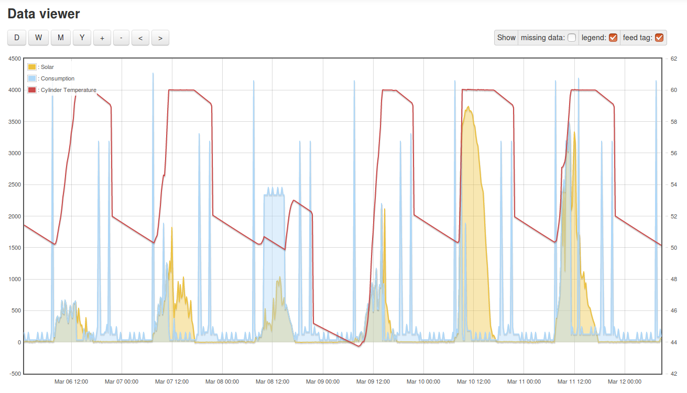
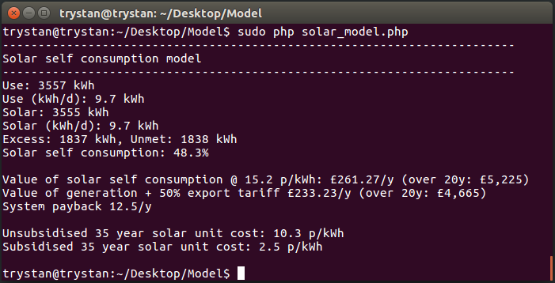

# Solar self-consumption model

- using high resolution 10s solar generation data from an emoncms feed
- creates household consumption model to experiment with load timing and types
- simulates PV Diversion with hot water cylinder
- simple EV charging profile option
- saves modelled consumption feed and cylinder temperature to output emoncms feeds

### Introduction

The degree of self consumption makes all the difference to the economics of domestic solar PV. Especially with recent reductions in feed in tariff rates in the UK and a view looking forward to unsubsidised solar.

Traditional household demand peaks in the morning and evenings on weekdays with a slightly more even profile on weekends. Solar generates most in the middle of the day resulting in a mismatch between supply and demand.

Traditional demand without using excess solar for hot water, smart charging of EV’s or battery stores results in a self consumption of around 15-25%.

The following table shows outline 20 year savings for different self consumption levels and income from FIT + export tariffs for a 4kW grid-tie solar pv system generating an average of 3500 kWh/year for 20 years and costing £6000 (installed 2017). Self consumption savings are based on a standard electricity price of 15 p/kWh. Figures have been rounded to the nearest £100. Calculation assumes no energy cost inflation above retail-price-index to keep things simple:

| Self use | 20y Saving | FIT + Export | Total   | Payback | 35y p/kWh |
|----------|------------|--------------|---------|---------|-----------|
| 25%      | £2,600     | £4,600       | £7,200  | 16.6    | 6.1       |
| 50%      | £5,300     | £4,600       | £9,800  | 12.2    | 3.0       |
| 75%      | £7,900     | £4,600       | £12,500 | 9.6     | 2.0       |
| 100%     | £10,500    | £4,600       | £15,100 | 8.0     | 1.5       |

For a view towards unsubsidised solar, this time over a potential 35 year system lifespan including an inverter replacement costing £400 in year 20:

| Self use | 35y Saving | Payback | p/kWh |
|----------|------------|---------|-------|
| 25%      | £4,600     | 45.7    | 20.9  |
| 50%      | £9,200     | 22.9    | 10.4  |
| 75%      | £13,800    | 15.2    | 7.0   |
| 100%     | £18,400    | 11.4    | 5.2   |

### Increasing self-consumption 

**1. Diversion of excess solar to hot water**

For households with immersion or instantaneous domestic hot water heating provided for on a standard electricity tariff, using solar to heat water at times of excess supply can make a lot of sense. The simplest way of doing this is with a PV Diverter – a box of power electronics that measures the amount of excess solar available and ‘diverts’ this excess electricity to an immersion heater. A more efficient but more complex way of doing this and more limited in terms of responsiveness would be to heat hot water via a heat pump.

**2. Day time and smart charging of an electric vehicle.**

Smart charging an EV when the sun is shining could also increase self consumption, particularly useful to anyone that works partly from home, or where the car is left at home perhaps on sunny days and its possible to cycle to work? Alternatively smart charging of EV’s at work would also make a lot of sense.

**3. Battery storage**

Another option much talked about at the moment due to the dropping price, a battery store can soak up solar during the day and make it available later in the evening when demand is usually highest.

### Assessing the impact of different solutions on self consumption

In order to quickly get an idea for the potential levels of self consumption that could be reached with different demand patterns, PV Diversion, EV charging and battery storage, I have constructed a detailed household electricity model. The model uses high resolution 10s solar pv data collected by monitoring, constructs a detailed model of household demand and from this calculates the degree of self consumption that would result from different household demand profiles.

The household model covers the traditional demands such as: lighting, laptops, internet router, central heating standby, kettle, electric shower, electric cooking, fridge/freezer, washing machine. Each with start and end times, power levels and in the case of fridge/freezer cycle repeat times. Weekday and weekend schedules are also taken into account.

PV Diversion, smart EV charging and battery storage can then be added to explore how self consumption increases.

The model includes basic cost data in order to calculate payback times and the resulting unit cost of the delivered useful electricity. The cost model takes into account inverter and if applicable battery replacement cost and assumes price reductions in these components over time.

### Example results

The following example results are for a household with low traditional electricity consumption due to use of LED lighting and efficient appliances. Electricity consumption for this household is currently 4.7 kWh/d of which standby is 0.7 kWh/d, electric shower is 1.5 kWh/d, fridge is 0.4 kWh/d, lighting and computers ~ 1.0 kWh/d and electric cooking 1.1 kWh/d.

For this baseline household a number of scenarios are modelled from adding solar by itself, to combination with PV diversion, EV demand and battery storage.

| Description                                                                                    | Use        | Solar kWp        | Self-use % | Payback | 20y unit cost inc subsidy | 35y unit cost inc subsidy | 35y unit cost w/o subsidy |
|------------------------------------------------------------------------------------------------|------------|------------------|------------|---------|---------------------------|---------------------------|---------------------------|
| Traditional household demand + 2kWp of solar                                                   | 4.6 Wh/d   | 2.0 kWp, 4.9 kWh/d | 18.10%     | 35.5y    | 23.9                      | 15.4                      | 36.1                      |
| Traditional household demand + 4kWp of solar                                                   | 4.6 kWh/d  | 4.0 kWp, 9.7 kWh/d | 10.90%     | 29.4y    | 17.2                      | 12.8                      | 47.1                      |
| 2 kWp solar + PV Diversion                                                                     | 5.4 kWh/d  | 2.0 kWp, 4.6 kWh/d | 56.70%     | 14.3y    | 7.6                       | 4.9                       | 11.5                      |
| 2.2 kWp solar + PV Diversion                                                                     | 5.4 kWh/d  | 2.2 kWp, 5.4 kWh/d | 52.80%     | 14.4y    | 7.5                       | 4.9                       | 12                        |
| EV Demand + PV Diversion                                                                       |            |                  |            |         |                           |                           |                           |
| 2 kWp solar + PV Diversion + EV demand 3 days                                                  | 9.6 kWh/d  | 2.0 kWp, 4.9 kWh/d | 71.90%     | 12.5y    | 6                         | 3.9                       | 9.1                       |
| 2 kWp solar + PV Diversion + EV demand 5 days                                                  | 10.9 kWh/d | 2.0 kWp, 4.9 kWh/d | 75.60%     | 12.1y    | 5.7                       | 3.7                       | 8.7                       |
| 4 kWp solar + PV Diversion + EV demand 3 days                                                  | 9.7 kWh/d  | 4.0 kWp, 9.7 kWh/d | 48.30%     | 12.1y    | 3.9                       | 2.9                       | 10.6                      |
| 4 kWp solar + PV Diversion + EV demand 5 days                                                  | 11.0 kWh/d | 4.0 kWp, 9.7 kWh/d | 52.60%     | 11.6y    | 3.6                       | 2.7                       | 9.8                       |
| 4 kWp solar + PV Diversion + EV demand 5 days + 20% reduction in solar cost                    | 11.0 kWh/d | 4.0 kWp, 9.7 kWh/d | 52.60%     | 9.3y     | 0.4                       | 0.8                       | 8                         |
| Battery Storage                                                                                |            |                  |            |         |                           |                           |                           |
| 2 kWp solar + 2.5 kWh battery                                                                  | 4.7 kWh/d  | 2.0 kWp, 4.9 kWh/d | 53.90%     | 19.8y    | 14.9                      | 9.9                       | 16.8                      |
| 4 kWp solar + 2.5 kWh battery                                                                  | 4.7 kWh/d  | 4.0 kWp, 9.7 kWh/d | 30.60%     | 18.4y    | 12.2                      | 8.7                       | 21                        |
| 2 kWp solar + 2.5 kWh battery + PV Divert                                                      | 5.3 kWh/d  | 2.0 kWp, 4.9 kWh/d | 80.80%     | 15.5y    | 9.9                       | 6.6                       | 11.2                      |
| 4 kWp solar + 2.5 kWh battery + PV Divert                                                      | 5.3 kWh/d  | 4.0 kWp, 9.7 kWh/d | 49.50%     | 14.6y    | 7.5                       | 5.4                       | 12.9                      |
| 2 kWp solar + 5 day EV + 2.5 kWh battery + PV Divert                                           | 10.7 kWh/d | 2.0 kWp, 4.9 kWh/d | 94.60%     | 13.9y    | 8.5                       | 5.6                       | 9.6                       |
| 4 kWp solar + 5 day EV + 2.5 kWh battery + PV Divert                                           | 11.1 kWh/d | 4.0 kWp, 9.7 kWh/d | 71.40%     | 11.8y    | 5.2                       | 3.7                       | 9                         |
| 4 kWp solar + 5 day EV + 2.5 kWh battery + PV Divert + 20% cost reduction in solar and battery | 11.1 kWh/d | 4.0 kWp, 9.7 kWh/d | 71.40%     | 9.5y     | 2.4                       | 2.1                       | 7.3                       |
